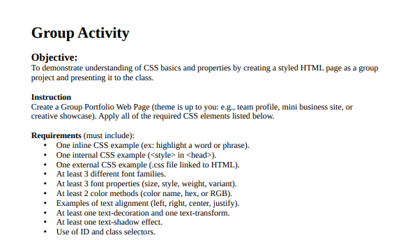

# CSS Properties Group Activity

## Project Overview

This project is a group activity designed to demonstrate comprehensive understanding and implementation of CSS (Cascading Style Sheets) properties. The activity showcases a team member profile page that incorporates various CSS techniques including inline, internal, and external styling methods, along with advanced CSS properties for fonts, text effects, colors, selectors, and animations.

## Live Demo

🌐 View the live project at: [https://carldv.github.io/for-css/](https://carldv.github.io/for-css/)

## Team Members

- **Jedric Buan**
- **Mark Justine Valdez**
- **Joren Jacob**
- **Nino Salandanan**
- **David Luto**

## Features Implemented

### CSS Implementation Methods

#### 1. External CSS (`style.css`)
- Main stylesheet containing global styles
- Animation keyframes and transitions
- Hover effects and transforms

#### 2. Internal CSS (within `<style>` tags in `index.html`)
- `.highlight` class with color, text-decoration, and text-transform properties
- `#intro` ID selector with multiple font and text properties
- `.content` class styling

#### 3. Inline CSS (directly in HTML elements)
- Custom font-family declarations for personalized descriptions

### CSS Properties Demonstrated

#### Font Properties
- `font-family`: Multiple font stacks including system fonts, serif, sans-serif, and monospace
- `font-size`: Various size declarations (rem, px units)
- `font-style`: Italic styling
- `font-weight`: Bold text
- `font-variant`: Small-caps transformation

#### Text Effects
- `text-align`: alignments
- `text-decoration`: Underline effects
- `text-transform`: Uppercase transformation
- `text-shadow`: Shadow effects with offset and blur

#### Color Methods
- **RGB**: `rgb(0, 0, 0)`, `rgb(255, 255, 255)`, etc.
- **Hex**: `#ff5733` for highlighting
- **RGBA**: `rgba(0, 0, 0, 0.1)` for semi-transparent shadows
- **Named colors**: `white`, `black`

#### Selectors
- **Element selectors**: `body`, `h1`, `p`, `img`
- **Class selectors**: `.highlight`, `.all`, `.forimg`, `.content`
- **ID selectors**: `#intro`
- **Pseudo-class selectors**: `:hover`
- **Attribute selectors**: Styling through various HTML attributes

## Project Structure

```
for-css/
├── index.html          # Main HTML file with team member profiles
├── style.css           # External stylesheet
├── buan.jpg           # Team member photo
├── david2.jpg         # Team member photo
├── jacob copy.png     # Team member photo
├── onin.jpg           # Team member photo
├── test.png           # Team member photo
├── act.png            # Activity description
└── README.md          # This file
```

## Activity Requirements

This project fulfills all requirements of the CSS properties activity.

## Activity Description & Rubric



*The complete activity description, requirements, and evaluation rubric can be found in the image above.*

